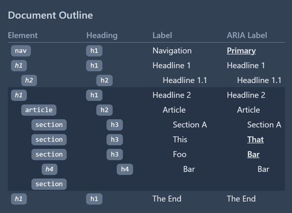

react-outline
=============

A React component that shows a live document outline.

The outline always updates itself in sync with the current document. This also works with hot module replacement.



Legend:

- **Italic element name** - Denotes an implicit subsection. This only happens for heading elements (`<h1>` etc.)
- **Bold + underlined ARIA label** - Denotes an ARIA landmark.
- **Shaded area** - Denotes content inside the `<main>` element.


Usage
-----

To add to your project:

```
npm install --save @blizzy/react-outline
```

Somewhere in your app, you can use this to show the current page's outline:

```typescript
import { Outline } from '@blizzy/react-outline'

<div className="fixed top-5 right-5 z-50 rounded-lg bg-white p-5 shadow-md dark:bg-slate-700">
  <Outline />
</div>
```

react-outline uses [Tailwind CSS] for styling. If you use Tailwind CSS as well, you may want to add
react-outline's source to your `content` configuration:

```typescript
module.exports = {
  content: [
    // ...
    './node_modules/@blizzy/react-outline/dist/**',
  ],
}
```


License
-------

react-outline is licensed under the MIT license.


[Tailwind CSS]: https://tailwindcss.com/
